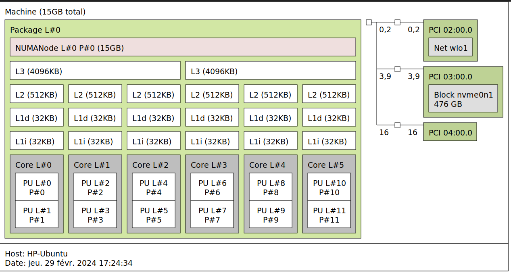

# Fourmi2024

markdown ou pdf
Faire le speedup, graphe, analyse
- analyse a priori (embarrassingly parallel ou pas? équilibré ou pas? memory bound ou cpu bound?)
- expliquer strat parallélisation
- code
- vérif code
- mesure analyse des perfs
- autocritique, ccl


affichage/calcul
paralléliser fourmis
pas à faire : paralléliser grille
    mais pistes réflexion dessus

import os
os.environ["OMP_NUM_THREADS"] = "1"
os.environ["MKL_NUM_THREADS"] = "1"

# Compte Rendu

Quentin Loriaux - Samy Vincent

executer cette commande :
mpirun -np 1 python3 gui.py : -np 1 python3 grid.py

## Analyse a priori

Les fourmis semblent complètement indépendantes et ça doit être quasi embarrasingly parallelisable.
les phéromones sont additionnées grace à mpiReduce, de même pour food_counter

Les phéromones en revanche risquent de devoir être traitées par découpage de la map... bruh
Difficile de voir comment faire car un process peut avoir des fourmis dans les 4 coins de la map qui posent des phéromones.
C'est surement ça la partie laby à pas implémenter


## Notre configuration



## Idées


## Problèmes...

utiliser comm.reduce ou éviter la granularité avec un unique comm.gather (entre gui/grille)


## trucs à repiquer

```
#! /bin/bash

echo "# cpus   time(s)"

# for smp in 1 2 4 8 $(seq 12 4 96) ; do
for smp in $(seq 1 200) ; do
    /bin/echo -e -n "$smp \t "
    OMP_NUM_THREADS=$smp ./Mandelbrot-openmp.exe |cut -d ' ' -f 6
    # OMP_NUM_THREADS=$smp taskset --cpu-list 0-${smp} ./Mandelbrot.exe |cut -d ' ' -f 6
done
```

J'imagine qu'on peut mesurer :
"time before first food par ex"
ou "time before 20 food" bref...